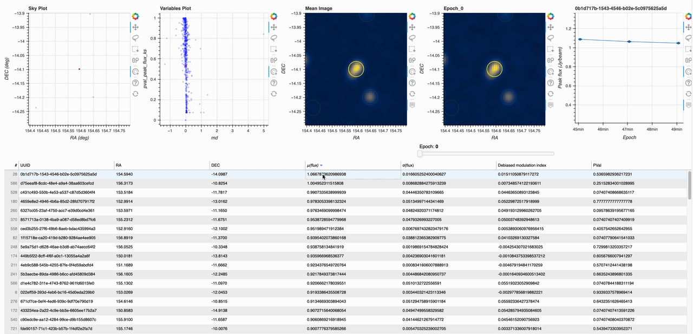
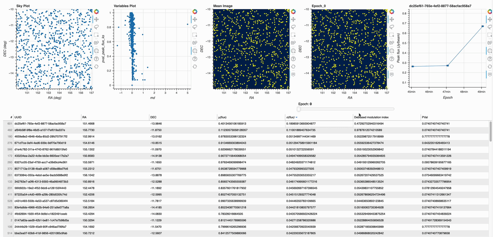
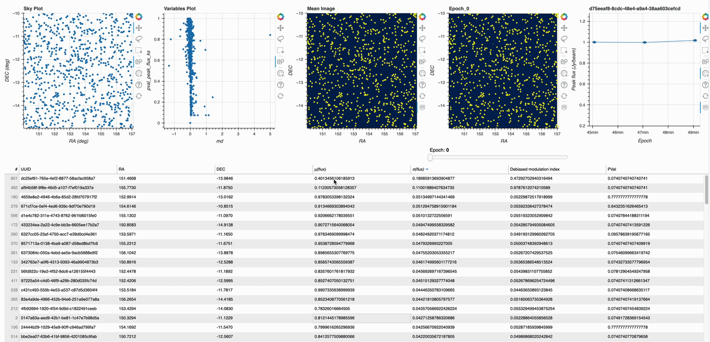

(visualisation)=
## Visualisation

To start the Docker container containing the Bokeh server, run the following script in the main Nextflow directory:

``` bash
./run_robbie_viewer.sh
```

This will run the viewer using the images output from Robbie within the default ``results`` directory. If your output directory is different to the default, you can add either the relative or absolute path as an optional argument:

``` bash
./run_robbie_viewer.sh path_to_dir
```

### Visualising transients 

Visualising different transient candidates can be done in multiple ways. For example, the transient candidate can be selected using the table, sky plot or variables plot as shown below:



### Visualising transient Epoch's

Cycling through Epoch's for each transient candidate is just as easy, for example you can use either the Epoch slider or select each Epoch in the Peak Flux vs. Epoch graph:



### Transient candidate selection

Bokeh has multiple ways to interact with the data shown in the plots and table. To select multiple transient candidates, one option is to hold ``shift`` and click on the table entries. Once we zoom out, we can see all the selected transients on each plot:



The Box select tool can also be used to select transient candidates. After drawing the bounding box for selection, the transient candidates are highlighted in the other plots as well as the table below:

