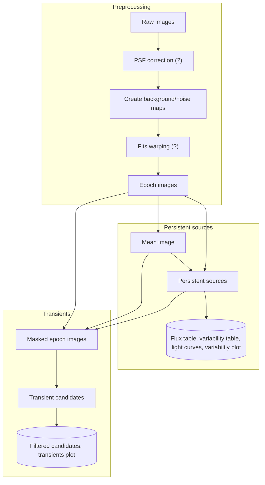

(workflow)=
## Workflow
The workflow was described initially in [Hancock et al. 2018](https://ui.adsabs.harvard.edu/abs/2019A%26C....27...23H/abstract) however the current workflow is shown below:
- Preprocessing:
  - Convolve all images to a common psf (optional)
  - Create background and noise maps (if they are not found)
  - Correct astrometry using fitswarp (optional)
- Variabile/persistent source detection:
  - Stack the warped images to form a mean image
  - Source find on the mean image to make a reference catalogue
  - Priorized fit this catalogue into each of the individual images
  - Join the epoch catalogues to make a persistent source catalogue
  - Calculate variability stats and generate a light curve for each source
- Transient candidate identification:
  - Use the persistent source to mask known sources from the individual epochs
  - Source find on the masked images to find transients
  - Concatenate transients into a single catalogue, identifying the epoch of each detection

Items with a (?) are optional processing steps that can be turned on/off.
Items in a cylinder are the final outputs of the processing workflow.